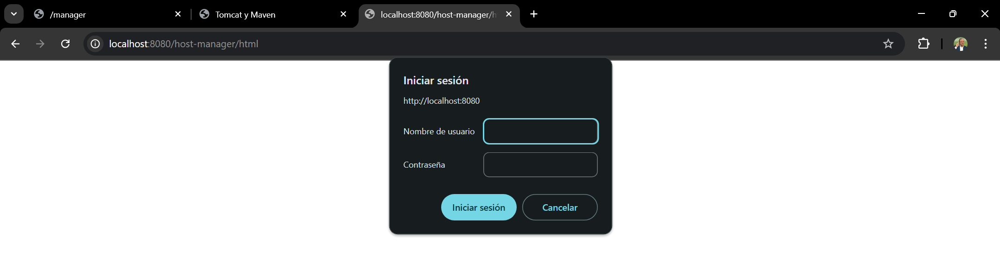
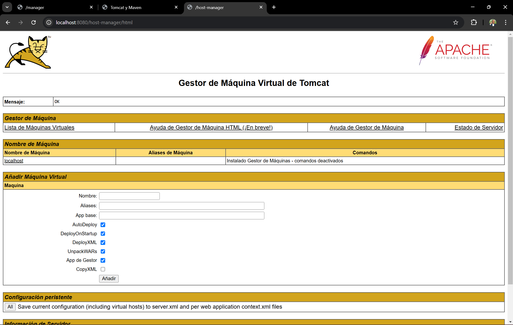
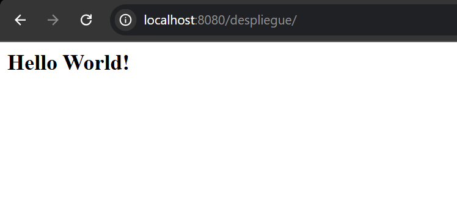

# Script de Configuración e Instalación de Tomcat y Maven

Este script en Bash automatiza la instalación, configuración y despliegue de aplicaciones en un entorno con Apache Tomcat y Maven. Incluye pasos para configurar usuarios, roles y proyectos listos para desplegar.

## Requisitos previos

Configuración de Vagrant

## Descripción del Script

### 1. Instalación de dependencias
- Actualiza los repositorios e instala:
  - **OpenJDK 11**.
  - **Apache Tomcat 9** y sus herramientas administrativas.
  - **Maven** para la gestión de proyectos Java.

### 2. Configuración de Tomcat
- Crea un grupo y un usuario específicos para Tomcat.
- Configura el usuario administrador en `tomcat-users.xml` con roles como `admin` y `manager`.
- Permite el acceso remoto a los paneles administrativos mediante la configuración del archivo `context.xml`.

### 3. Administrador web

### 4. Despliegue con Tomcat

- Nos identificamos

- Seleccionamos el archivo que vamos a subir

-Pulsamos sobre la url 

### 5. Configuración de Maven
- Añade un servidor llamado `Tomcat` en el archivo `settings.xml` de Maven con credenciales para despliegue automático.

### 6. Creación de un proyecto con Maven
- Genera un proyecto web básico usando el arquetipo `maven-archetype-webapp`.
- Configura el plugin de Tomcat Maven para automatizar el despliegue del proyecto.

### 7. Clonación y despliegue de ejemplo
- Clona el repositorio [rock-paper-scissors](https://github.com/cameronmcnz/rock-paper-scissors).
- Modifica el `pom.xml` para configurar el despliegue en Tomcat.
- Despliega la aplicación en Tomcat con Maven.

